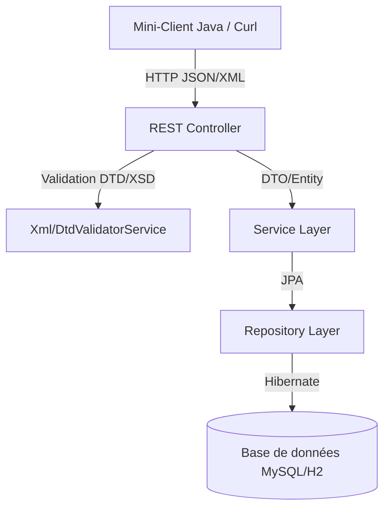

# RAPPORT DE PROJET : DÉVELOPPEMENT D'UNE API REST AVEC PERSISTANCE ET VALIDATION XML
**Université Mohammed V, ENSIAS**  
**Cours : Technologies XML & Services Web**  
**Enseignante : Prof. Najat Chadli**  

---

## ╔══════════════════════════════════════════════════════════════╗
##   INFORMATIONS GÉNÉRALES
##   • Projet : Projet 5 - API REST avec validation XML (Niveau Avancé)
##   • Technologies : Java, Spring Boot, JPA/Hibernate, H2/MySQL, JUnit 5, SAX/DOM, XSD, DTD
## ╚══════════════════════════════════════════════════════════════╝

---

## Table des Matières
1. [Introduction & Objectifs](#1-introduction--objectifs)
2. [Architecture Technique & Base de Données](#2-architecture-technique--base-de-données)
3. [Structure des Données, Services et Contrôleurs](#3-structure-des-données-user-product-task)
   - [3.1 Classe User](#31-classe-user)
   - [3.2 Classe Product](#32-classe-product)
   - [3.3 Classe Task](#33-classe-task)
   - [3.4 Couche Métier (Services)](#34-couche-métier-services)
   - [3.5 Couche REST (Contrôleurs)](#35-couche-rest-contrôleurs)
4. [Validation XML](#4-validation-xml)
   - [4.1 Validation Schema (XSD) pour User](#41-validation-schema-xsd-pour-user)
   - [4.2 Validation DTD pour Product & Task](#42-validation-dtd-pour-product--task)
5. [Tests Unitaires & d'Intégration (JUnit 5)](#5-tests-unitaires--dintégration-junit-5)
6. [Mini-Client Java (Console Interactive)](#6-mini-client-java-console-interactive)
7. [Guide d'Exécution & Démonstration](#7-guide-décomposition--démonstration)
8. [Conclusion](#8-conclusion)

---

## 1. Introduction & Objectifs

L'objectif de ce projet est de concevoir et réaliser une **API REST robuste** capable de manipuler des ressources (Utilisateurs, Produits, Tâches) à la fois sous formats **JSON** et **XML**, tout en intégrant des mécanismes stricts de validation XML.

### Missions réalisées (Niveau Avancé) :
* **Export et Import XML/JSON** transparent via l'API REST.
* **Validation XML bidirectionnelle** :
  * Validation par Schéma XML (**XSD**) pour les Utilisateurs (`User`).
  * Validation par **DTD** pour les Produits (`Product`) et les Tâches (`Task`).
* **Couverture de tests complète (JUnit 5 + Mockito)** avec base de données de test en mémoire (H2).
* **Mini-client Java** autonome et interactif pour simuler les appels à l'API.

---

## 2. Architecture Technique & Base de Données

L'application est structurée selon l'architecture multicouche standard de Spring Boot :



* **ORM (Hibernate/JPA)** : Utilisé pour mapper automatiquement les classes Java aux tables de la base de données.
* **Base de données de production** : MySQL.
* **Base de données de test** : H2 Database (base de données SQL en mémoire, réinitialisée à chaque lancement de test).

---

## 3. Structure des Données (User, Product, Task)

Chaque ressource est configurée pour supporter la persistance en base de données et la conversion XML/JSON :

### 3.1 Classe User
Représente un utilisateur avec des validations de contraintes sur les attributs :
```java
@Entity
@Table(name = "users")
@Data
@NoArgsConstructor
@AllArgsConstructor
@JacksonXmlRootElement(localName = "user")
public class User {
    @Id 
    @GeneratedValue(strategy = GenerationType.IDENTITY)
    private Long id;

    @NotBlank(message = "Le nom est obligatoire")
    private String name;

    @Email(message = "Email invalide")
    @NotBlank(message = "L'email est obligatoire")
    private String email;

    @NotBlank(message = "Le mot de passe est obligatoire")
    private String password;
}
```

### 3.2 Classe Product
Représente un produit avec son prix :
```java
@Entity
@Table(name = "products")
@Data
@JacksonXmlRootElement(localName = "product")
public class Product {
    @Id @GeneratedValue(strategy = GenerationType.IDENTITY)
    private Long id;
    @NotBlank(message = "Le nom est obligatoire")
    private String name;
    @Positive(message = "Le prix doit être positif")
    private double price;
    private String description;
}
```

### 3.3 Classe Task
Représente une tâche de travail :
```java
@Entity
@Table(name = "tasks")
@Data
@JacksonXmlRootElement(localName = "task")
public class Task {
    @Id @GeneratedValue(strategy = GenerationType.IDENTITY)
    private Long id;
    @NotBlank(message = "Le titre est obligatoire")
    private String title;
    private boolean completed;
    private String description;
}
```

### 3.4 Couche Métier (Services)
La couche service (`Service Layer`) implémente la logique métier et sert d'intermédiaire entre la couche de persistance (Repositories) et les contrôleurs REST. Les services injectent les repositories correspondants via constructeur grâce à Lombok (`@RequiredArgsConstructor`).

#### Rôle et Fonctionnalités des Services :
* **ProductService** : Gère la persistance et les mises à jour des produits.
* **UserService** : Gère la création des utilisateurs avec cryptage des mots de passe ou validation et stockage des structures XML/JSON.
* **TaskService** : Permet de gérer le cycle de vie des tâches de travail.

Chaque service expose des méthodes CRUD classiques retournant des objets encapsulés (`Optional<T>`) pour une gestion propre des ressources inexistantes.

*Exemple d'implémentement métier avec [ProductService](file:///Users/marwa/Desktop/xml_project/src/main/java/com/example/xml_project/service/ProductService.java) :*
```java
@Service
@RequiredArgsConstructor
public class ProductService {
    private final ProductRepository productRepository;

    public List<Product> getAllProducts() {
        return productRepository.findAll();
    }

    public Optional<Product> getProductById(Long id) {
        return productRepository.findById(id);
    }

    public Product createProduct(Product product) {
        return productRepository.save(product);
    }

    public Optional<Product> updateProduct(Long id, Product updated) {
        return productRepository.findById(id).map(existing -> {
            existing.setName(updated.getName());
            existing.setPrice(updated.getPrice());
            existing.setDescription(updated.getDescription());
            return productRepository.save(existing);
        });
    }

    public boolean deleteProduct(Long id) {
        if (!productRepository.existsById(id)) return false;
        productRepository.deleteById(id);
        return true;
    }
}
```

### 3.5 Couche REST (Contrôleurs)
La couche contrôleur REST expose l'API HTTP publique. Elle supporte la négociation de contenu pour accepter et produire du **JSON** et du **XML** à l'aide de l'en-tête `Accept` et de l'en-tête `Content-Type`.

#### Rôle et Fonctionnalités des Contrôleurs :
* **Mapping des endpoints REST** standard (`GET`, `POST`, `PUT`, `DELETE`).
* **Gestion des exceptions et statuts HTTP** appropriés (ex: `201 Created` pour la création, `204 No Content` pour la suppression, `404 Not Found` en cas de ressource inexistante).
* **Validation de requêtes** : Utilise l'annotation `@Valid` pour déclencher les contraintes Jakarta Bean Validation (ex: `@NotBlank`, `@Email`) définies directement sur les modèles.
* **Endpoints dédiés à la validation XML brute** : Reçoivent les chaînes XML non sérialisées sur la route `/xml`, invoquent les validateurs XSD ou DTD correspondants, désérialisent manuellement via `XmlMapper` si validation réussie, et renvoient des erreurs structurées `400 Bad Request` en cas d'échec de conformité XML.

*Exemple de contrôleur avec [ProductController](file:///Users/marwa/Desktop/xml_project/src/main/java/com/example/xml_project/controller/ProductController.java) :*
```java
@RestController
@RequestMapping("/api/products")
@RequiredArgsConstructor
public class ProductController {
    private final ProductService productService;
    private final DtdValidatorService dtdValidatorService;

    @GetMapping(produces = {MediaType.APPLICATION_JSON_VALUE, MediaType.APPLICATION_XML_VALUE})
    public List<Product> getAllProducts() {
        return productService.getAllProducts();
    }

    @PostMapping(consumes = MediaType.APPLICATION_JSON_VALUE)
    public ResponseEntity<Product> createProduct(@Valid @RequestBody Product product) {
        return ResponseEntity.status(HttpStatus.CREATED).body(productService.createProduct(product));
    }

    @PostMapping(value = "/xml", consumes = MediaType.APPLICATION_XML_VALUE, produces = MediaType.APPLICATION_XML_VALUE)
    public ResponseEntity<?> createProductFromXml(@RequestBody String xmlBody) {
        try {
            dtdValidatorService.validate(xmlBody);
            XmlMapper xmlMapper = new XmlMapper();
            Product product = xmlMapper.readValue(xmlBody, Product.class);
            return ResponseEntity.status(HttpStatus.CREATED).body(productService.createProduct(product));
        } catch (SAXException e) {
            return ResponseEntity.badRequest().body("XML invalide (DTD) : " + e.getMessage());
        } catch (Exception e) {
            return ResponseEntity.internalServerError().body("Erreur interne : " + e.getMessage());
        }
    }
}
```

---

## 4. Validation XML

### 4.1 Validation Schema (XSD) pour User
Le fichier `user.xsd` impose les contraintes suivantes :
* **Nom** : Entre 2 et 100 caractères.
* **Email** : Doit correspondre à une expression régulière avec un `@` et un `.`.
* **Mot de passe** : 4 caractères minimum.

#### Extrait du fichier `user.xsd` :
```xml
<xs:element name="user">
    <xs:complexType>
        <xs:sequence>
            <xs:element name="id" type="xs:long" minOccurs="0"/>
            <xs:element name="name">
                <xs:simpleType>
                    <xs:restriction base="xs:string">
                        <xs:minLength value="2"/>
                        <xs:maxLength value="100"/>
                    </xs:restriction>
                </xs:simpleType>
            </xs:element>
            <xs:element name="email">
                <xs:simpleType>
                    <xs:restriction base="xs:string">
                        <xs:pattern value="[^@]+@[^@]+\.[^@]+"/>
                    </xs:restriction>
                </xs:simpleType>
            </xs:element>
        </xs:sequence>
    </xs:complexType>
</xs:element>
```

Le service `XmlValidatorService` charge ce schéma et l'applique à la string XML reçue lors d'un `POST /api/users/xml`.

---

### 4.2 Validation DTD pour Product & Task
Pour le produit et la tâche, nous utilisons une validation **DTD**.

#### Fichier `product.dtd` :
```dtd
<!ELEMENT product (id?, name, price, description?)>
<!ELEMENT id      (#PCDATA)>
<!ELEMENT name    (#PCDATA)>
<!ELEMENT price   (#PCDATA)>
<!ELEMENT description (#PCDATA)>
```

Le validateur DTD utilise le parser DOM natif avec la validation activée. Le XML reçu du client doit référencer la DTD via un DOCTYPE :
```xml
<?xml version="1.0" encoding="UTF-8"?>
<!DOCTYPE product SYSTEM "product.dtd">
<product>
    <name>Clavier Mécanique</name>
    <price>89.99</price>
</product>
```

Le service `DtdValidatorService` utilise un **EntityResolver** pour charger la DTD directement depuis le classpath du serveur (évitant d'avoir à stocker le fichier DTD sur le disque client).

---

## 5. Tests Unitaires & d'Intégration (JUnit 5)

Une suite complète de **44 tests JUnit 5** a été développée et validée avec succès.

### Types de Tests implémentés :
1. **Tests Unitaires (Mockito)** : Validation de la logique métier (Services) de manière isolée sans démarrer le serveur.
2. **Tests d'Intégration HTTP (MockMvc + WebMvcTest)** : Validation des controllers, des routes, des codes de retour HTTP (200, 201, 204, 400, 404) et des formats de sortie.
3. **Tests de validation de documents XML** : Validation des cas valides et invalides XSD et DTD (Ex: email invalide, prix négatif, champs requis manquants).

### Résultats des Tests :
```text
[INFO] Results:
[INFO] 
[INFO] Tests run: 44, Failures: 0, Errors: 0, Skipped: 0
[INFO] 
[INFO] ------------------------------------------------------------------------
[INFO] BUILD SUCCESS
[INFO] ------------------------------------------------------------------------
```

---

## 6. Mini-Client Java (Console Interactive)

Un client Java autonome a été développé dans `com.example.xml_project.client.ApiClient`. Il propose un menu console interactif qui permet de tester en direct toutes les fonctionnalités de l'API :

* **Affichage couleur** des statuts HTTP (Vert pour 2xx, Rouge pour 4xx/5xx).
* **Création JSON** de toutes les ressources.
* **Validation XSD interactive** : Permet d'envoyer un XML utilisateur et de visualiser l'erreur retournée par le serveur en cas d'email incorrect.
* **Validation DTD interactive** : Envoie un XML produit avec sa déclaration DOCTYPE et teste la validation DTD du serveur.

---

## 7. Guide d'Exécution & Démonstration

### 7.1 Lancer l'API Spring Boot
Dans un premier terminal, exécutez :
```bash
./mvnw spring-boot:run
```

### 7.2 Lancer le Mini-Client Java
Dans un second terminal, lancez le client :
```bash
./mvnw exec:java -Dexec.mainClass="com.example.xml_project.client.ApiClient"
```

### 7.3 Exécuter les tests unitaires
Pour relancer les tests JUnit 5 :
```bash
./mvnw test
```

---

## 8. Conclusion

Ce projet démontre comment allier la flexibilité des architectures modernes **REST (JSON/XML)** à la rigueur des standards XML historiques (**XSD et DTD**). L'intégration de tests automatisés JUnit 5 garantit la stabilité et le bon fonctionnement de l'application face aux données invalides, tandis que le mini-client Java offre un moyen convivial de manipuler et valider ces architectures.
